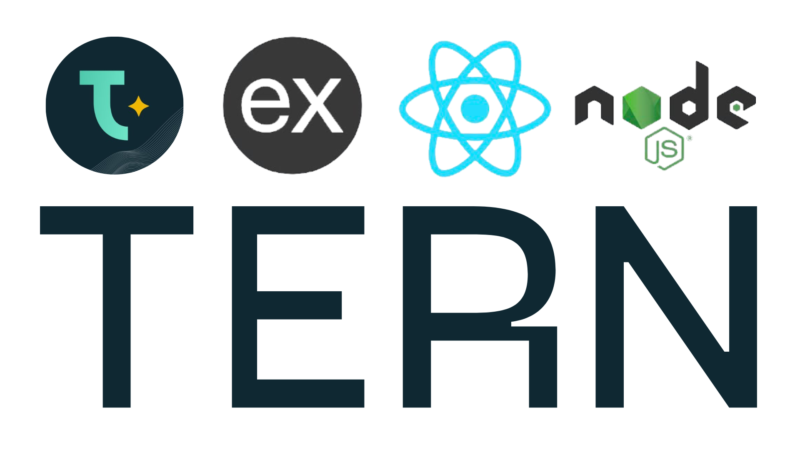
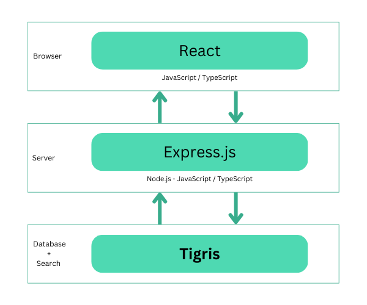

# The TERN stack template



The TERN stack:

- [**T**igris](https://www.tigrisdata.com?utm_source=github&utm_medium=github&utm_campaign=tern-stack-template):
  Serverless NoSQL Database & Search platform
- [**E**xpress.js](https://expressjs.com/): Fast, unopinionated, minimalist web
  framework for Node.js
- [**R**eact](https://react.dev/): The library for web and native user
  interfaces
- [**N**ode.js](https://nodejs.org): an open-source, cross-platform JavaScript
  runtime environment



## About the TERN stack template

The template has the following structure and make use of
[NPM workspaces](https://docs.npmjs.com/cli/v7/using-npm/workspaces):

```
.
├── apps
│   ├── client
│   │   ├── public
│   │   └── src
│   └── server
│       ├── scripts
│       └── src
└── packages
    └── shared
        └── src
```

The repo has the following workspaces:

- `@tern-app/client` in `apps/client`: initially created using the `react-ts`
  template for
  [vite](https://vitejs.dev/guide/#scaffolding-your-first-vite-project)
- `@tern-app/server` in `apps/server`: a TypeScript application using
  [Express.js](https://expressjs.com/), the
  [Node.js runtime](https://nodejs.org), and
  [Tigris](https://www.tigrisdata.com?utm_source=github&utm_medium=github&utm_campaign=tern-stack-template).
- `@tern-app/shared`: for code that is used in both the `@tern-app/server` and
  `@tern-app/client`

## Prerequisites

To use the TERN stack template you'll either need a
[Tigris Cloud account](https://console.preview.tigrisdata.cloud/signup?utm_source=github&utm_medium=github&utm_campaign=tern-stack-template)
or a
[self-hosted Tigris](https://www.tigrisdata.com/docs/concepts/platform/self-host/?utm_source=github&utm_medium=github&utm_campaign=tern-stack-template)
up and running.

## Quickstart

### Install dependencies

Install the dependencies for all the workspaces using the following command:

```sh
npm i -ws
```

### Create a Tigris project

There's a script in `./package.json` called `tigris:init` that does that for
you. It takes a `--project` argument:

```sh
npm run tigris:init --project=tern-app
```

Use a different value to `tern-app` for your Tigris project name if you like.

This will then take you through the login flow to authenticate the
[Tigris CLI](https://github.com/tigrisdata/tigris-cli) with Tigris Cloud (by
default). If you haven't already signed up, you can also go through the signup
flow.

Once the CLI has been authenticated a file, `apps/server/.env.local`, will be
created containing your Tigris project config.

### Run the client

In one terminal run:

```sh
npm run dev -w=@tern-app/client
```

The client will run on `localhost:3000` by default.

### Run the server

In another terminal run:

```sh
npm run dev -w=@tern-app/server
```

The server will run on `localhost:3001` by default.

### Start building

Open the code in your favourite editor and start building your TERN app.

## Additional scripts

### Client (`apps/client`)

The client is a TypeScript React application. To learn React, check out the
[React documentation](https://reactjs.org/).

For the `apps/client` workspace, you can run:

#### `npm dev -w=@tern-app/client`

Runs the app in the development mode.\
Open [http://localhost:3000](http://localhost:3000) to view it in the browser.

The page will reload if you make edits.\
You will also see any lint errors in the console.

#### `npm run build -w=@tern-app/client`

Builds the app for production to the `dist` folder.

### Server (`apps/server`)

The server is an Express.js TypeScript application. To learn Express.js, check
out the [Express.js website](https://expressjs.com/).

Before you start the server you'll need to create a Tigris project and save the
project configuration in a `.env.local` file. The top-level `package.json` has a
script for that. See the Quickstart section for details.

With the Tigris project config in place you can run the server.

For the `apps/server` workspace, you can run:

#### `npm run dev -w=@tern-app/server`

Runs the app in the development mode, running on
[http://localhost:3001](http://localhost:3001).

The application will reload if you make edits.

#### `npm run setup -w=@tern-app/server`

Registers the Tigris data models with Tigris. For more info, see the
[Tigris data modeling with TypeScript docs](https://www.tigrisdata.com/docs/sdkstools/typescript/database/datamodel/?utm_source=github&utm_medium=github&utm_campaign=tern-stack-template).

#### `npm run start -w=@tern-app/server`

Runs the built output from `dist`.

#### `npm run build -w=@tern-app/server`

Builds the app for production to the `dist` folder.\
It correctly bundles React in production mode and optimizes the build for the best
performance.

Your app is ready to be deployed!
